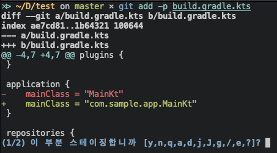
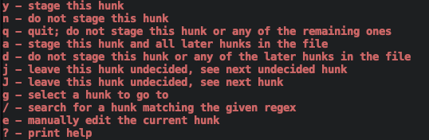
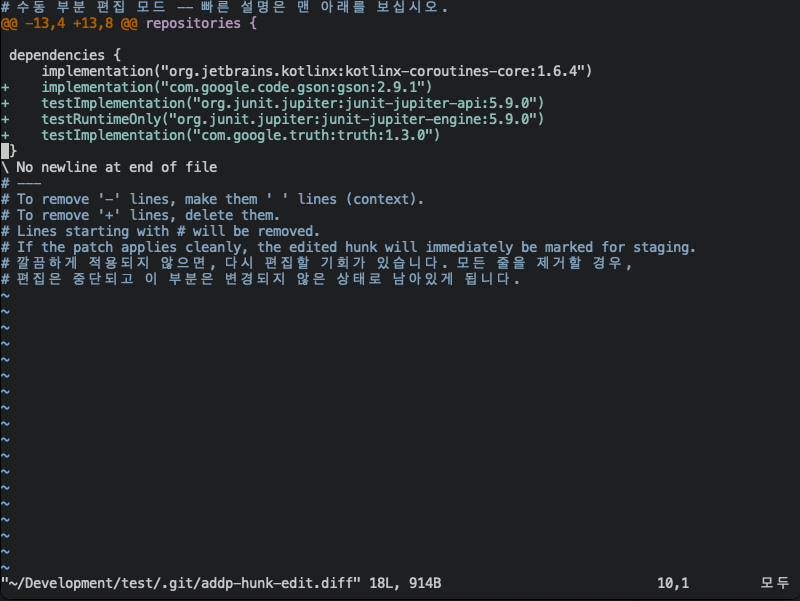

Git을 쓰다 보면 가끔 파일 변경사항의 일부분만 커밋하고 싶을 때가 있다.
예를 들면 이렇다.

```kotlin
plugins {
    kotlin("jvm") version "1.6.10"
    id("application")
}

application {
    mainClass = "MainKt"
}

repositories {
    mavenCentral()
}

dependencies {
    implementation("org.jetbrains.kotlinx:kotlinx-coroutines-core:1.6.4")
}
```

수정 전의 `build.gradle.kts` 파일이 위와 같다고 해보자.
여기서 `Main.kt`의 위치가 바뀌었고, 새로운 라이브러리를 추가했다.
`mainClass`를 수정해 주고, 새로운 라이브러리 의존성을 `implementation`으로 추가했다.

```diff
plugins {
    kotlin("jvm") version "1.6.10"
    id("application")
}

application {
-    mainClass = "MainKt"
+    mainClass = "com.sample.app.MainKt"
}

repositories {
    mavenCentral()
}

dependencies {
    implementation("org.jetbrains.kotlinx:kotlinx-coroutines-core:1.6.4")
+    implementation("com.google.code.gson:gson:2.9.1")
}
```

아마 이렇게 변했을 것이다.
그런데 새 라이브러리는 아직 커밋하고 싶지 않다.
그렇다면 main의 위치는 커밋하면서 라이브러리 의존성 추가 부분은 빼야 한다.
문제는 이게 한 파일에 있다는 것이다.

예전에는 커밋에서 뺄 부분을 잠시 없앴다가 커밋 후 복구하는 방법도 썼었다.
그런데 굳이 그렇게 할 필요가 없다.

## Hunk

Git에는 hunk라는 개념이 있다.
아마 잘 못들어 보았을 것인데, 나도 이 방법을 알기 전까지는 몰랐다.

간단하게 말하자면 _변경사항의 단위_ 를 부르는 용어다.
위에서는 `mainClass = "MainKt"`가 `mainClass = "com.sample.app.MainKt"`로 변한 것과, `implementation("com.google.code.gson:gson:2.9.1")`이 추가된 것이 서로 다른 hunk가 된다.

그렇다면 각 hunk를 따로 stage에 추가할 수 있다면 문제가 해결된다.

## git add -p

Hunk 단위로 stage에 추가하는 명령어가 `git add -p`다.
터미널에 명령을 쳐 보자.



명령을 쳐 보면 각 hunk당 1번씩 스테이징 할 것이냐는 질문을 던진다.
`y`를 입력하면 이 부분을 stage에 추가하는 것이고, `n`는 하지 않는다는 것이다.



둘 외에도 옵션이 많은데, `?`를 입력하면 힌트를 보여준다.

이 명령을 통해 커밋할 hunk만 추가하고 커밋하면 원하던 부분 커밋이 가능해진다.

## 더 잘게 자르기

아직 문제가 완벽하게 해결되지 않았다.
분리해서 커밋하고 싶은 변경사항이 붙어있어서 한 hunk로 처리된다면 이를 쪼개야 한다.

`git add -p`에서 제공하는 수많은 옵션 중에 `s`라는 것이 있다.
`s`는 현재 hunk를 더 잘게 쪼개라는 것이다.
하지만 `s`를 쪼개지 못하는 경우 선택지에 없는 경우도 있다. (위의 스크린샷 들에도 `s`는 없다)
이 때 선택할 수 있는 옵션이 `e`이다.
바로 수동 편집 기능이다.



`e`를 사용하면 편집기가 열리면서 hunk를 줄별로 조절할 수 있게 된다.
사용법은 간단하다.
스테이징 하고 싶지 않은 줄은 지우거나 `#`로 주석 처리하면 된다.
