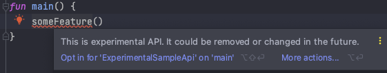

프로젝트를 개발하다 보면 항상 안정된 상태로 배포하는 것은 어려운 일이다.
실험적인 기능이 들어가기도 하고 아직 불안정한 채 배포될 수도 있다.

그런 기능들이 개발자가 아닌 최종 사용자에게 배포될 때는 공지나 UI 등 우회적인 방법으로 풀어내야 한다.
예를 들면 카카오톡의 실험실이 있겠다.
그런데 내가 배포하는 프로젝트가 라이브러리, 프레임워크와 같이 개발자를 위한 경우라면 어떻게 해야 할까?
이 기능이 불안정하다는 것을 어떻게 개발자에게 알려줄 수 있을까?

가장 쉬운 방법은 릴리즈 노트에 적는 것일 것 같다.
하지만 매 릴리즈마다 직접 적어줘야 하는 불편함이 있고, 릴리즈 노트를 제대로 읽지 않았거나 잊어버릴 수도 있다.

어쩌면 함수나 클래스 등의 이름에 녹여 내는 방법을 생각할 수도 있겠다.
나는 이런 방법은 쓰고 싶지 않다.
예를 들어 새 기능이 추가되었는데 항상 `experimental` 같은 이름이 따라붙고 안정화 후엔 이름이 바뀐다?
불특정 다수가 사용할 수 있는 라이브러리와 같은 프로젝트에서 이런 명명법은 아주 부적절하다 생각한다.

만약 `Deprecated` 어노테이션처럼 코드에 메타 데이터로 제공하면 어떨까?
명명법에도 영향이 없고, 어노테이션만 붙였다가 떼면 된다.
코틀린에서는 이런 기능을 opt-in이라는 이름으로 제공한다.

## Opt-in

우선 Opt-in (옵트인) 이라는 용어가 뭘까?
Opt-in이 가장 많이 사용되는 분야는 아무래도 보안 영역일 것 같다.
보통 사용자에게 동의를 얻은 후에야 그 정보를 사용할 수 있는 것을 말한다.
비슷하게 코틀린의 Opt-in 기능은 '사용자가 명시적으로 동의한 후에 해당 기능을 사용할 수 있게 만드는 기능'이다.

## Opt-in 사용하기

나만의 Opt-in을 정의하기 위해서는 2가지 절차가 있다.

1. 첫째로, 나만의 어노테이션을 하나 만든다.
2. 둘째로 위에서 만든 어노테이션에 `RequireOptIn`을 달아준다.

### 어노테이션 만들기

Opt-In을 요구하기 위해서는 어노테이션이 하나 필요하다.
이 어노테이션이 동의를 요구 할 이름이 될 것이기에 신중히 정의하자.

```kotlin
annotation class ExperimentalSampleApi
```

### RequireOptIn 달아주기

어노테이션을 만든 후, `RequireOptIn` 어노테이션을 내가 만든 어노테이션에 달아 주어야 한다.
`RequireOptIn`에는 2가지 파라미터를 줄 수 있는데 하나는 Opt-in 메세지이고 하나는 레벨이다.

```kotlin
@RequiresOptIn(
    message = "This is experimental API. It could be removed or changed in the future.",
    level = RequiresOptIn.Level.ERROR
)
annotation class ExperimentalSampleApi
```

레벨에는 `Warning`과 `Error` 2가지가 있는데, 기본값은 `Error`다.

- Wraning: 컴파일러가 경고 표시만 해주고 그대로 사용 가능하도록 한다.
- Error: 사용하는 측에서 Opt-in을 하지 않으면 컴파일 할 수 없다.

### Opt-in을 사용하고 싶은 곳에 달아주기

새 Opt-in 어노테이션을 만들었으니 명시하고 싶은 곳에 달아주면 된다.

```kotlin
@ExperimentalSampleApi
fun someFeature() {}
```



이제 Opt-in 어노테이션이 달린 기능을 사용할 때는 위와 같이 메세지를 확인 할 수 있다.

```kotlin
@OptIn(ExperimentalSampleApi::class)
fun main() {
    someFeature()
}
```

이렇게 `OptIn`을 추가 해 주고 나서야 오류가 사라지는 것을 볼 수 있다.
명시적으로 오류가 나타나고, 코드 상에서 `OptIn` 어노테이션을 달아 주어야 하기에 개발자는 한 눈에 "아 실험적인 기능이구나"를 느낄 수 있다.

## 용례

Kotlin-first로 개발중인 프로젝트를 보면 Opt-in을 곳곳에서 사용중이다.

- [Kotlinx Coroutines](https://github.com/Kotlin/kotlinx.coroutines): `ExperimentalCoroutinesApi`, `InternalCoroutinesApi`, `DelicateCoroutinesApi` 등등 다양하게 활용하고 있다.
  특히 `InternalCoroutinesApi`처럼, internal 기능 일부도 Opt-in을 활용해서 경고를 하는 것을 볼 수 있다.
- [Jetpack Compose](https://github.com/androidx/androidx/tree/androidx-main/compose): Jetpack Compose에서는 굉장히 많은 Opt-in 어노테이션을 만들어 사용한다.
  `ExperimentalFoundationApi`, `ExperimentalComposeApi`, `ExperimentalComposeUiApi`, `ExperimentalTextApi`, `ExperimentalGridApi` 등등 각 기능에 따라 분리해 둔 것을 볼 수 있다.
- [Accompanist](https://github.com/google/accompanist): `ExperimentalPagerApi`, `ExperimentalPermissionsApi` 등 실험적인 기능마다 어노테이션이 정의되어 있다.

공통적으로 `PrefixFeatureApi`와 같은 이름을 붙인 것을 알 수 있다.

실험적 기능이면 `ExperimentalFeatureApi`, 내부에서만 사용하는 기능이라면 `InternalFeatureApi` 그 외에도 목적에 따라 prefix을 잘 명명해 사용한다.

코루틴의 `ExperimentalCoroutinesApi`처럼 라이브러리 이름을 사용해 공통적으로 사용하기도 하고 구글처럼 `ExperimentalFoundationApi`와 같이 기능에 따라 나누기도 한다.

## 정리

코틀린의 Opt-in 기능을 활용해 다른 개발자에게 특정 기능을 주의깊게 사용하도록 유도할 수 있다.
오픈소스 라이브러리를 개발하거나, 사내 라이브러리나 모듈 등을 만들 때 사용한다면 조금 더 체계적으로 API를 관리할 수 있겠다.

## 참조

- [Kotlin Official Documents - Opt-in requirements](https://kotlinlang.org/docs/opt-in-requirements.html)
