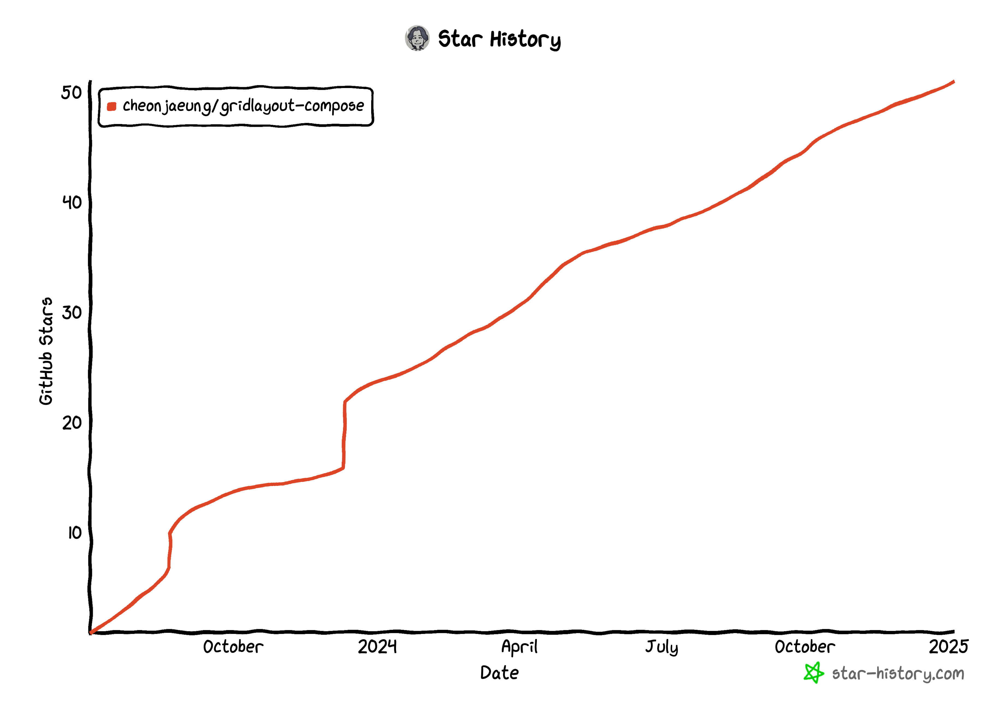

2024년이 끝나고 2025년이 되었다.
새 해를 맞이해 작년을 돌아보는 시간을 가졌다.
한 해를 돌아보니 2024년은 나에게 개발자로서 나름의 의미가 있는 한해인 것 같았고 글로 남겨 보자는 생각이 들었다.

## 만 3년의 경력

어제부로 안드로이드 개발자로 일한지 만 3년이 되었다.
이제 4년차로 접어드는 한 해가 되었다.
이제는 주변에서 보기에 신입이라는 딱지는 다 떨어지고 한 사람의 몫을 하는 개발자로 바라보는 시기가 된 것 같다.
대학을 졸업하고 취업을 준비하던 때도 그렇게 오래 지나지 않은 것 같은데 어느덧 내가 4년차 개발자라니 시간이 정말 빠르다는 생각을 하게 되었다.
그러면서도 한편으로는 내가 4년차 개발자로서 역량을 갖추었는지 되돌아보게 된다.

4년차 5년차가 되면 점점 기술적으로 숙련되어서 내 분야에서 한 사람 몫을 제대로 해야 하는 시기라고 생각한다.
더 나아가서 주변 분야에 대해서도 어드 정도의 지식을 갖추면서 사고의 폭이 넓어지는 시기인 것 같다.

나는 과연 그런 사람일까?
2025년은 내가 부족한 지점을 찾아서 보완해보는 한 해가 되어도 좋을 것 같다는 생각이 든다.

## 개인 도메인 변경

예전부터 몇년 정도 사용하던 woong.io 도메인을 떠나고 2024년 3월쯤부터 cheonjaeung.com 도메인을 구매해 이전하기 시작했다.

첫 번째 이유는 블로그의 검색 노출이 제대로 되지 않았기 때문이다.
이유는 지금도 모르지만 woong.io로 만들었던 내 블로그는 구글 검색에 제대로 노출되지 않았다.
Google Search Console에 등록해보는 것을 포함해 여러 가지 조치를 시도해봤지만 먹히지 않았다.
블로그를 적극적으로 홍보할 생각은 없지만 그렇다고 검색에도 나오지 않는 글을 쓰고 싶지는 않았다.
마침 위의 이유와 겹치며 도메인을 바꾸게 되었다.
다행히 신규 도메인은 잘 노출된다.

다른 한 가지 이유는 .io 도메인의 불안정성 때문이였다.
.io는 영국령 인도양 지역에 할당된 국가 코드 도메인인데 국제사법재판소의 반환 판결이 내려지며 애매해지게 되었다는 소식을 들었다.
물론 .io 도메인은 수많은 IT 기업이 사용하기 때문에 섣불리 조치되지는 않을 것으로 보이지만 위의 이유와 함께 훨씬 안정적인 .com 도메인으로 넘어가기로 결심했다.

도메인을 바꾸는 작업은 다소 귀찮았다.
그 중 가장 귀찮은 작업은 내 오픈 소스 프로젝트들을 내 신규 도메인으로 마이그레이션 하는 것이였다.
이미 이전 도메인으로 배포한 버전들은 수정할 수 없지만, 향후 배포할 버전들은 이전 도메인을 쓰기 찜찜했다.
나는 woong.io 도메인을 더 이상 유지할 생각이 없었고 만료 시점 이후부터는 내 도메인이 아닐텐데 계속 쓰기는 싫었다.

Maven Central은 한 번 배포된 버전은 수정 불가가 원칙이기에 이미 배포되었거나 더 이상 유지보수 하지 않는 것들은 그대로 두기로 했다.
대신 내가 계속 유지보수하거나 열심히 개발중인 프로젝트만 마이그레이션 하기로 했다.
라이브러리의 패키지 이름을 바꾸고, 라이브러리 배포도 새로운 그룹 ID로 배포해야 했다.
또한 프로젝트 릴리즈 노트에 변경되었다는 사항을 공지했다.

정말 귀찮은 작업이였지만 하지 않았다면 계속 거슬리는 부분이였을 것이기에 마이그레이션 하기를 잘했다고 생각한다.

## 2024년의 오픈 소스 프로젝트

2023년 중반쯤 처음 릴리즈를 시작했던 [GridLayout for Compose](https://github.com/cheonjaeung/gridlayout-compose/) 라이브러리가 GitHub Star 50개를 넘으며 내 프로젝트 중 가장 스타를 많이 가진 프로젝트가 되었다.
2024년 초에는 20개 초반이였던 개수가 이 글을 쓰는 시점에는 51개가 되었다.

사실 만들게 된 계기는 간단했다.
"Compose로 UI를 만드는데 그리드 레이아웃이 없다니, 그렇다면 내가 만들어봐야지" 라는 간단한 생각이였다.
정말 그리드 하나만 제공하는 라이브러리지만 생각보다 찾는 사람이 있다는 것이 놀라웠다.

만드는 동안 가장 신경썼던 부분은 공식 Compose 라이브러리와 최대한 이질감이 없도록 하는 것이였다.
그리드는 기초적인 레이아웃이기 때문에 사용할 때 다른 기초 레이아웃들과 쉽게 녹아드는 것이 중요하다고 생각했다.
그 때문에 Jetpack Compose의 내부 코드를 많이 찾아보며 동작과 구조를 파악하는 데에 시간을 많이 소비했다.
당시에는 코드를 이해하기 위해 찾아보고 공부해야 할 것이 많아 힘들었지만 지금 돌이켜보면 많은 도움이 되었다고 생각한다.

이슈도 몇 번 보고되고 버그를 찾고 수정하고를 여러번 진행했다.
한번은 버그를 잘 수정했다고 생각했는데 또다른 엣지 케이스에서 발생해서 머리를 싸맸던 기억도 있다.
그 덕분에 테스트 케이스를 다양하게 만들어야겠다고 느끼고 100개 이상의 테스트 케이스를 만들어 그리드의 다양한 상황에 대해 자동 테스트 되도록 만들었다.

현 시점에서 처음 생각했던 기초적인 동작은 모두 안정화되었고 앞으로는 조금 더 고급 기능이나 추가할 만 한 옵션 등이 생각나면 작업할 생각이다.

또 다른 2가지 프로젝트도 진행중이다.
2023년에 0.2.0을 배포하고 개발을 중단했던 [PowerWheelPicker](https://github.com/cheonjaeung/powerwheelpicker-android/releases)를 처음부터 다시 재구현해 1.0.0을 배포했다.
또, WheelPicker를 만들며 아이디어를 얻어 [SimpleCarousel](https://github.com/cheonjaeung/simplecarousel-android)이라는 프로젝트도 별도로 진행중이다.
이 두 프로젝트는 아직 갈 길이 멀지만 2025년에는 그럴듯한 모습을 갖추도록 노력해 볼 생각이다.
